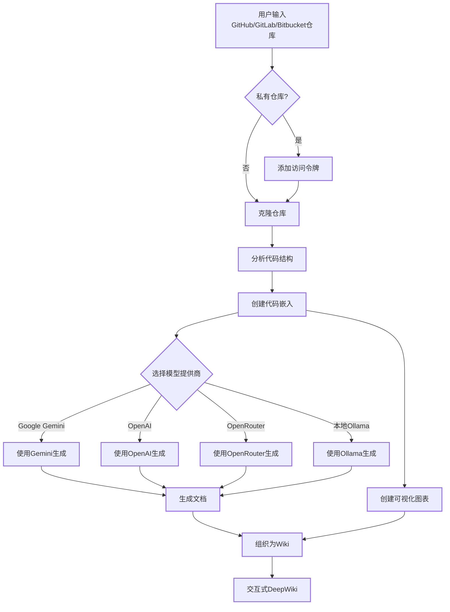

# DeepWiki-Open


**DeepWiki**可以为任何GitHub、GitLab或BitBucket代码仓库自动创建美观、交互式的Wiki！只需输入仓库名称，DeepWiki将：

1. 分析代码结构
2. 生成全面的文档
3. 创建可视化图表解释一切如何运作
4. 将所有内容整理成易于导航的Wiki

[](https://buymeacoffee.com/sheing)

[](https://x.com/sashimikun_void)
[](https://discord.com/invite/VQMBGR8u5v)

## ✨ 特点

- **即时文档**：几秒钟内将任何GitHub、GitLab或BitBucket仓库转换为Wiki
- **私有仓库支持**：使用个人访问令牌安全访问私有仓库
- **智能分析**：AI驱动的代码结构和关系理解
- **精美图表**：自动生成Mermaid图表可视化架构和数据流
- **简易导航**：简单、直观的界面探索Wiki
- **提问功能**：使用RAG驱动的AI与您的仓库聊天，获取准确答案
- **深度研究**：多轮研究过程，彻底调查复杂主题
- **多模型提供商**：支持Google Gemini、OpenAI、OpenRouter和本地Ollama模型

## 🏗️ 架构

本仓库分为两个独立应用：

- **`api/`** — 后端（Python / FastAPI）：仓库分析、嵌入、Wiki 生成与聊天，运行在 `:8001`。
- **`web/`** — 前端（**Nuxt 4** / Vue 3）：UI 运行在 `:3001`，并把 API / WebSocket 请求代理到后端。详见 [`web/README.md`](./web/README.md)。

> 前端已由 Next.js/React 整体重写为 **Nuxt 4**（Vue 3 + `@nuxt/ui` + Tailwind v4）。Docker 镜像现为**纯后端**，前端单独运行/构建。

## 🚀 快速开始

### 1. 配置 `.env`

在项目根目录创建 `.env`（后端读取）：

```
GOOGLE_API_KEY=your_google_api_key        # 使用 Google Gemini 模型时必需
OPENAI_API_KEY=your_openai_api_key        # 使用 OpenAI 模型 / embedding 时必需
OPENROUTER_API_KEY=your_openrouter_api_key # 可选，使用 OpenRouter 模型时
```

> 内部部署（DashScope + 自建 GitLab）的完整 `.env` 模板见 [本地开发.md](./本地开发.md)。

### 2. 启动后端（Docker）

```bash
docker compose up -d        # 后端 API → http://localhost:8001
```

（`docker-compose.yml` 会把主机的 `~/.adalflow` 挂载到容器，持久化克隆仓库 `repos/`、嵌入索引 `databases/`、Wiki 缓存 `wikicache/`，容器停止/移除后数据仍在。）

或手动运行后端：

```bash
python -m pip install poetry==2.0.1 && poetry install -C api
python -m api.main
```

### 3. 启动前端（Nuxt 4，位于 `web/`）

```bash
cd web
npm install
npm run dev                 # → http://localhost:3001
# 需要后端 env(如 GITLAB_TOKEN)时:set -a; . ../.env; set +a; npm run dev
```

前端通过 Nitro 的 `routeRules` / `server/api/` 把 `/api/*` 与 WebSocket 代理到后端，**无需额外配置**。生产部署：`cd web && npm run build` 后用 `node web/.output/server/index.mjs`（用 `SERVER_BASE_URL` 指向后端）。

### 4. 使用 DeepWiki！

1. 在浏览器中打开 [http://localhost:3001](http://localhost:3001)
2. 输入 GitHub、GitLab 或 Bitbucket 仓库（如 `https://github.com/openai/codex`、`https://gitlab.com/gitlab-org/gitlab`）
3. 对于私有仓库，点击"+ 添加访问令牌"并输入您的 GitHub 或 GitLab 个人访问令牌
4. 点击"生成Wiki"，见证奇迹的发生！

> 💡 **获取密钥的地方：** [Google AI Studio](https://makersuite.google.com/app/apikey) / [OpenAI Platform](https://platform.openai.com/api-keys)

## 🔍 工作原理

DeepWiki使用AI来：

1. 克隆并分析GitHub、GitLab或Bitbucket仓库（包括使用令牌认证的私有仓库）
2. 创建代码嵌入用于智能检索
3. 使用上下文感知AI生成文档（使用Google Gemini、OpenAI、OpenRouter或本地Ollama模型）
4. 创建可视化图表解释代码关系
5. 将所有内容组织成结构化Wiki
6. 通过提问功能实现与仓库的智能问答
7. 通过深度研究功能提供深入研究能力



## 🛠️ 项目结构

```
deepwiki/
├── api/                  # 后端 API 服务器（Python / FastAPI）
│   ├── main.py           # API 入口
│   ├── api.py            # FastAPI 实现
│   ├── rag.py            # 检索增强生成
│   ├── data_pipeline.py  # 数据处理工具
│   └── config/           # 模型 / embedding / 仓库 配置
│
├── web/                  # 前端（Nuxt 4 / Vue 3）
│   ├── app/
│   │   ├── pages/        # 路由页面（首页、[owner]/[repo] wiki、slides、workshop）
│   │   ├── components/   # Vue 组件（Markdown、Mermaid、WikiTreeView、AskPanel…）
│   │   ├── composables/  # 渲染器 / 数据编排（useWikiData、useMarkdownRenderer）
│   │   └── utils/        # 助手与生成提示词
│   ├── server/api/       # BFF（Nitro，代理到后端）
│   └── nuxt.config.ts
│
└── .env                  # 环境变量（需要创建）
```

> 前端技术栈：Nuxt 4 · Vue 3 · `@nuxt/ui` · Tailwind v4 · markdown-it + Shiki + KaTeX + Mermaid；i18n（`@nuxtjs/i18n`，10 种语言）+ 主题（`@nuxtjs/color-mode`，VSCode 风格暗/亮）。完整迁移说明见 [web/README.md](./web/README.md)。

## 🤖 提问和深度研究功能

### 提问功能

提问功能允许您使用检索增强生成（RAG）与您的仓库聊天：

- **上下文感知响应**：基于仓库中实际代码获取准确答案
- **RAG驱动**：系统检索相关代码片段，提供有根据的响应
- **实时流式传输**：实时查看生成的响应，获得更交互式的体验
- **对话历史**：系统在问题之间保持上下文，实现更连贯的交互

### 深度研究功能

深度研究通过多轮研究过程将仓库分析提升到新水平：

- **深入调查**：通过多次研究迭代彻底探索复杂主题
- **结构化过程**：遵循清晰的研究计划，包含更新和全面结论
- **自动继续**：AI自动继续研究直到达成结论（最多5次迭代）
- **研究阶段**：
  1. **研究计划**：概述方法和初步发现
  2. **研究更新**：在前一轮迭代基础上增加新见解
  3. **最终结论**：基于所有迭代提供全面答案

要使用深度研究，只需在提交问题前在提问界面中切换"深度研究"开关。

## 📱 截图


*DeepWiki的主界面*


*使用个人访问令牌访问私有仓库*


*深度研究为复杂主题进行多轮调查*

## ❓ 故障排除

### API密钥问题
- **"缺少环境变量"**：确保您的`.env`文件位于项目根目录并包含所需的API密钥
- **"API密钥无效"**：检查您是否正确复制了完整密钥，没有多余空格
- **"OpenRouter API错误"**：验证您的OpenRouter API密钥有效且有足够的额度

### 连接问题
- **"无法连接到API服务器"**：确保API服务器在端口8001上运行
- **"CORS错误"**：API配置为允许所有来源，但如果您遇到问题，请尝试在同一台机器上运行前端和后端

### 生成问题
- **"生成Wiki时出错"**：对于非常大的仓库，请先尝试较小的仓库
- **"无效的仓库格式"**：确保您使用有效的GitHub、GitLab或Bitbucket URL格式
- **"无法获取仓库结构"**：对于私有仓库，确保您输入了具有适当权限的有效个人访问令牌
- **"图表渲染错误"**：应用程序将自动尝试修复损坏的图表

### 常见解决方案
1. **重启两个服务器**：有时简单的重启可以解决大多数问题
2. **检查控制台日志**：打开浏览器开发者工具查看任何JavaScript错误
3. **检查API日志**：查看运行API的终端中的Python错误

## 🤖 基于提供者的模型选择系统

DeepWiki 实现了灵活的基于提供者的模型选择系统，支持多种 LLM 提供商：

### 支持的提供商和模型

- **Google**: 默认使用 `gemini-2.5-flash`，还支持 `gemini-2.5-flash-lite`、`gemini-2.5-pro` 等
- **OpenAI**: 默认使用 `gpt-5-nano`，还支持 `gpt-5`, `4o` 等
- **OpenRouter**: 通过统一 API 访问多种模型，包括 Claude、Llama、Mistral 等
- **Ollama**: 支持本地运行的开源模型，如 `llama3`

### 环境变量

每个提供商需要其相应的API密钥环境变量：

```
# API密钥
GOOGLE_API_KEY=your_google_api_key        # Google Gemini模型必需
OPENAI_API_KEY=your_openai_api_key        # OpenAI模型必需
OPENROUTER_API_KEY=your_openrouter_api_key # OpenRouter模型必需

# OpenAI API基础URL配置
OPENAI_BASE_URL=https://custom-api-endpoint.com/v1  # 可选，用于自定义OpenAI API端点

# 配置目录
DEEPWIKI_CONFIG_DIR=/path/to/custom/config/dir  # 可选，用于自定义配置文件位置

# 授权模式
DEEPWIKI_AUTH_MODE=true  # 设置为 true 或 1 以启用授权模式
DEEPWIKI_AUTH_CODE=your_secret_code # 当 DEEPWIKI_AUTH_MODE 启用时所需的授权码
```

如果不使用ollama模式，那么需要配置OpenAI API密钥用于embeddings。其他密钥只有配置并使用对应提供商的模型时才需要。

## 授权模式

DeepWiki 可以配置为在授权模式下运行，在该模式下，生成 Wiki 需要有效的授权码。如果您想控制谁可以使用生成功能，这将非常有用。
限制使用前端页面生成wiki并保护已生成页面的缓存删除，但无法完全阻止直接访问 API 端点生成wiki。主要目的是为了保护管理员已生成的wiki页面，防止被访问者重新生成。

要启用授权模式，请设置以下环境变量：

- `DEEPWIKI_AUTH_MODE`: 将此设置为 `true` 或 `1`。启用后，前端将显示一个用于输入授权码的字段。
- `DEEPWIKI_AUTH_CODE`: 将此设置为所需的密钥。

如果未设置 `DEEPWIKI_AUTH_MODE` 或将其设置为 `false`（或除 `true`/`1` 之外的任何其他值），则授权功能将被禁用，并且不需要任何代码。

### 配置文件

DeepWiki使用JSON配置文件管理系统的各个方面：

1. **`generator.json`**：文本生成模型配置
   - 定义可用的模型提供商（Google、OpenAI、OpenRouter、Ollama）
   - 指定每个提供商的默认和可用模型
   - 包含特定模型的参数，如temperature和top_p

2. **`embedder.json`**：嵌入模型和文本处理配置
   - 定义用于向量存储的嵌入模型
   - 包含用于RAG的检索器配置
   - 指定文档分块的文本分割器设置

3. **`repo.json`**：仓库处理配置
   - 包含排除特定文件和目录的文件过滤器
   - 定义仓库大小限制和处理规则

默认情况下，这些文件位于`api/config/`目录中。您可以使用`DEEPWIKI_CONFIG_DIR`环境变量自定义它们的位置。

## 🧩 使用 OpenAI 兼容的 Embedding 模型（如阿里巴巴 Qwen）

如果你希望使用 OpenAI 以外、但兼容 OpenAI 接口的 embedding 模型（如阿里巴巴 Qwen），请参考以下步骤：

1. 用 `api/config/embedder_openai_compatible.json` 的内容替换 `api/config/embedder.json`。
2. 在项目根目录的 `.env` 文件中，配置相应的环境变量，例如：
   ```
   OPENAI_API_KEY=你的_api_key
   OPENAI_BASE_URL=你的_openai_兼容接口地址
   ```
3. 程序会自动用环境变量的值替换 embedder.json 里的占位符。

这样即可无缝切换到 OpenAI 兼容的 embedding 服务，无需修改代码。

## 🤝 贡献

欢迎贡献！随时：
- 为bug或功能请求开issue
- 提交pull request改进代码
- 分享您的反馈和想法

## 📄 许可证

本项目根据MIT许可证授权 - 详情请参阅[LICENSE](LICENSE)文件。

## ⭐ 星标历史

[](https://star-history.com/#AsyncFuncAI/deepwiki-open&Date)
