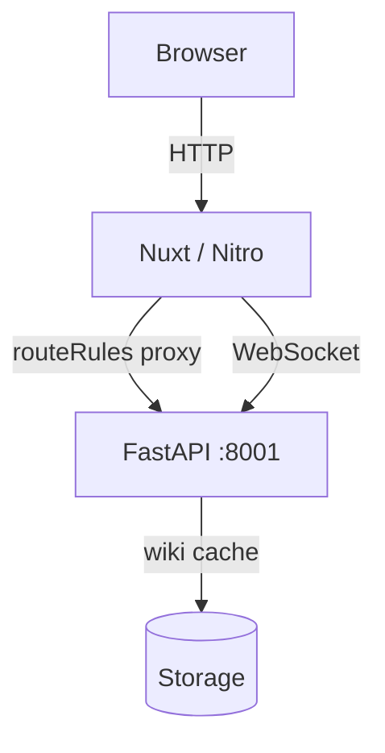
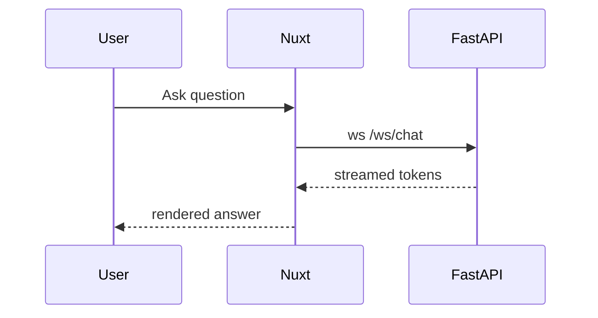

# 渲染管线自检 / Render Pipeline Demo

This page exercises the whole markdown pipeline ported from `Markdown.tsx`:
GFM, KaTeX math, shiki code highlighting, citation links, and Mermaid diagrams.
Autolink works too: https://github.com/AsyncFuncAI/deepwiki-open

## Normal heading (h2)

A paragraph with **bold**, *italic*, ~~strikethrough~~, and `inline code`.
Inline math renders with KaTeX: the mass–energy relation is $E = mc^2$, and the
golden ratio is $\varphi = \frac{1 + \sqrt{5}}{2}$.

### Lists (h3)

- First bullet
- Second bullet with a [bare file link](src/app/page.tsx)
  - Nested item
- Third bullet

1. Step one
2. Step two
3. Step three

#### Blockquote (h4)

> Mermaid diagrams and KaTeX both render in this pipeline.
> This quote spans two lines.

## ReAct headings (special styling)

## Thought
The model is reasoning about the next action.

## Action
Calling a tool to fetch repository structure.

## Observation
The tool returned a file tree.

## Answer
Here is the synthesized answer.

## Table (GFM)

| Concern | Next.js | Nuxt 4 |
| --- | --- | --- |
| Routing | App Router | file-based pages |
| Styling | Tailwind v4 | Tailwind v4 |
| i18n | next-intl | @nuxtjs/i18n |

## Block math

$$
\int_{-\infty}^{\infty} e^{-x^2}\,dx = \sqrt{\pi}
$$

## Code highlighting (shiki)

```typescript
interface RepoInfo {
  owner: string
  repo: string
  type: 'github' | 'gitlab' | 'bitbucket'
}

export function getRepoUrl(info: RepoInfo): string {
  return `https://${info.type}.com/${info.owner}/${info.repo}`
}
```

```python
def fibonacci(n: int) -> int:
    a, b = 0, 1
    for _ in range(n):
        a, b = b, a + b
    return a
```

```bash
cd web && SERVER_BASE_URL=http://localhost:8001 npm run dev
```

## Citation links

Relevant source files: [src/components/Ask.tsx](src/components/Ask.tsx) and
[src/utils/websocketClient.ts](src/utils/websocketClient.ts).

Inline citation with derived href (empty link target): Sources: [src/app/[owner]/[repo]/page.tsx:42-51]()

## Raw HTML (rehype-raw equivalent)

<div style="padding:0.5rem 0.75rem;border:1px dashed var(--accent-secondary);border-radius:0.375rem;">
  This block is raw HTML embedded in the markdown.
</div>

## Mermaid: flow diagram



## Mermaid: sequence diagram



Done — if everything above renders, the pipeline is proven.
